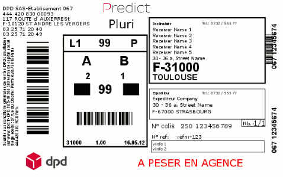

# dotnet-Svg.Contrib.Render.EPL.Demo

This demo converts [`assets/label.svg`](assets/label.svg) into [Eltron Programming Language (EPL)](https://en.wikipedia.org/wiki/Eltron_Programming_Language) code and sends it to all connected printers:

## Features

This demo has some additional hacks to show off the extensibility of [Svg.Contrib.Render.EPL](../Svg.Contrib.Render.EPL):

- [`Svg.Contrib.Render.EPL.Demo.CustomBootstrapper`](CustomBootstrapper.cs)
  - adapts some factories
- [`Svg.Contrib.Render.EPL.Demo.EplTransformer`](EplTransformer.cs)
  - adapts the font selection for some labels
  - adapts the position of some labels
- [`Svg.Contrib.Render.EPL.Demo.SvgImageTranslator`](SvgImageTranslator.cs)
  - when encountering a `SvgImage`-instance with `data-barcode` attribute set, the barcode is written directly instead of writing a graphic
  - adapts the barcode selection for some images
  - adapts the position for some images
