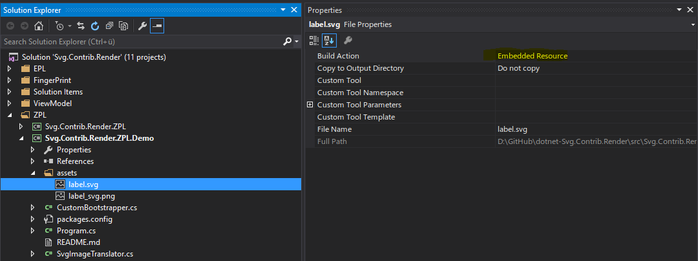
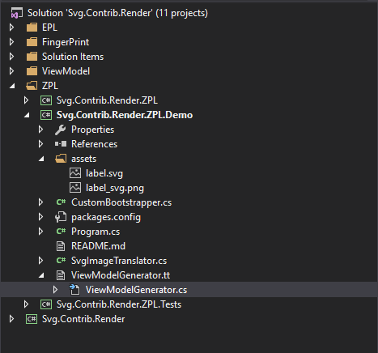

# dotnet-Svg.Contrib.ViewModel

This project creates *ViewModel*-classes for your included [SVG](https://en.wikipedia.org/wiki/Scalable_Vector_Graphics) files.

*Clarification: Actually the ViewModel is a Controller, but ViewModel sounds more appealing.*

## Build status

[](https://ci.appveyor.com/project/dittodhole/dotnet-svg-contrib-render)

## Installing

### myget.org

[](https://www.myget.org/feed/dittodhole/package/nuget/Svg.Contrib.ViewModel)

```powershell
PM> Install-Package -Id Svg.Contrib.ViewModel -pre --source https://www.myget.org/F/dittodhole/api/v2
```

### nuget.org

[](https://www.nuget.org/packages/Svg.Contrib.ViewModel)

```powershell
PM> Install-Package -Id Svg.Contrib.ViewModel
```

## Example



    PM> Install-Package Svg.Contrib.ViewModel



    var label = new label();
    label.LabelInfo = "some text";
    label.Visible_LabelInfo = false;
    label.Barcode_RouteBc = "1234567890";
    var svgDocument = label.SvgDocument;

## Features

- `SvgVisualElement.Visible`
- `SvgTextBase.Text`
- `SvgElement.CustomAttributes("data-barcode")`

## License

dotnet-Svg.Contrib.ViewModel is published under [WTFNMFPLv3](https://github.com/dittodhole/WTFNMFPLv3)

## Icon

[Generator](https://thenounproject.com/term/generator/7266/) by [john trillana](https://thenounproject.com/claxxmoldii) from the Noun Project.
